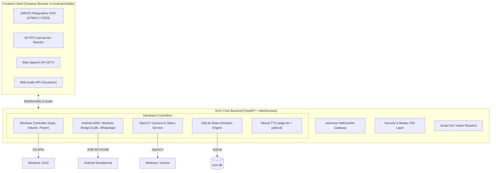

# 🌌 SUVI (Smart Unified Voice Intelligence)

> **A futuristic, cross-platform AI Voice Assistant for Windows & Android inspired by Iron Man's J.A.R.V.I.S.**

[](https://python.org)
[](https://fastapi.tiangolo.com)
[](https://websockets.readthedocs.io)
[](#frontend-jarvis-hud)
[](LICENSE)

---

## ⚡ Overview

**SUVI (Smart Unified Voice Intelligence)** is an advanced, unified voice assistant designed to bridge your **Windows PC** and **Android Phone** into a single cohesive cybernetic workstation. Featuring a high-performance **Python FastAPI + WebSockets** backend and a breathtaking **Cyberpunk JARVIS Holographic HUD**, SUVI responds naturally to spoken voice commands, executes deep OS automation, controls hardware, initiates phone calls, sends WhatsApp messages, dictates notes, and streams camera optics.

---

## ✨ Core Capabilities

### 🎙️ 1. Ultra-Realistic Neural Voice Engine
- **Hyper-Realistic Neural TTS**: Powered by Microsoft Edge Neural Speech (`edge-tts`) with realistic human-like cadence, inflection, and tone (British & American JARVIS personas).
- **100% Offline Fallback**: Seamless automatic fallback to `pyttsx3` when working offline.
- **Bi-Directional Audio Streaming**: Real-time Web Audio API frequency analysis that animates the visualizer in sync with voice input and output.

### 🛡️ 2. Futuristic JARVIS Holographic HUD
- **Interactive 60 FPS Canvas Arc Reactor**: Central glowing energy core that pulses, rotates, and expands based on assistant states (`STANDBY`, `LISTENING`, `PROCESSING`, `SPEAKING`).
- **Live System Telemetry**: Real-time gauges for CPU processor load, RAM utilization, Disk capacity, and Battery percentage.
- **Cross-Platform Responsive**: Runs in full resolution on Windows desktop monitors and scales seamlessly on Android mobile screens via local Wi-Fi.

### 💻 3. Deep Windows OS Automation
- **Universal App Launcher**: Open any application on your PC (`"Open Chrome"`, `"Launch VS Code"`, `"Open Spotify"`, `"Calculator"`, etc.).
- **Media & Hardware Controls**: Volume up, volume down, mute toggle, screen locking, power sleep, and hardware diagnostics.
- **Snapshot Capture**: Automatic full-desktop screenshot grabber with timestamps.

### 📱 4. Android Device Bridge (USB & Wireless ADB)
- **Initiate Phone Calls**: Voice command `"Call +1234567890"` directly executes calls on your connected Android phone via ADB intent.
- **WhatsApp Messaging**: Send or dictate WhatsApp messages (`"Send WhatsApp to Alex saying I will be there in 5 minutes"`).
- **Android App Launcher**: Launch Android apps (WhatsApp, YouTube, Camera, Spotify, etc.) directly from your PC.
- **Zero-Install Mobile Web**: Access SUVI from your Android phone browser at `http://<PC-IP>:8000` for mobile microphone speech recognition and camera recon.

### 📷 5. Optical Recon & Camera Vision
- **OpenCV Hardware Vision**: Stream live MJPEG camera feed directly into the holographic HUD.
- **Voice Photo Capture**: Command `"Take a photo"` or `"Take picture"` captures a snapshot, stamps it with cybernetic coordinates, and catalogs it.

### 📝 6. Voice Notes & Dictation Manager
- **SQLite-Backed Dictation**: Automatically transcribes, titles, and organizes your spoken notes.
- **Instant Search & Export**: Filter notes in real time or export all dictations to clean Markdown.

### 🔒 7. Enterprise-Grade Security
- **Master PIN Guard**: High-privilege actions (phone calls, outgoing messages, system shutdown, note wiping) are guarded by a customizable Master Security PIN.
- **API Token Validation**: REST endpoints and WebSockets protected with Bearer / API header tokens.

---

## 🏗️ Architecture



---

## 🚀 Quick Start Guide

### Option A: Windows 1-Click Launch (Recommended)
Simply double-click:
```bat
start_suvi.bat
```
*This automatically creates the Python virtual environment, installs dependencies, initializes configurations, launches the server, and opens the JARVIS HUD in your browser.*

---

### Option B: Manual Setup

1. **Clone the Repository**:
   ```bash
   git clone https://github.com/yourusername/SUVI.git
   cd SUVI
   ```

2. **Create and Activate Virtual Environment**:
   ```powershell
   python -m venv .venv
   .\.venv\Scripts\Activate.ps1
   ```

3. **Install Dependencies**:
   ```bash
   pip install -r requirements.txt
   ```

4. **Initialize Environment Variables**:
   ```bash
   cp .env.example .env
   ```

5. **Start SUVI**:
   ```bash
   python -m uvicorn backend.main:app --host 0.0.0.0 --port 8000 --reload
   ```

6. Open `http://localhost:8000` in Google Chrome or Microsoft Edge.

---

## 📱 Connecting Your Android Phone

SUVI provides zero-friction Android automation via **ADB (Android Debug Bridge)** over USB or Wi-Fi:

1. **Enable Developer Options & USB Debugging**:
   - On Android: Go to **Settings** > **About Phone** > Tap **Build Number** 7 times.
   - Go to **Developer Options** > Turn on **USB Debugging**.
2. **Connect via USB once**:
   - Run the included setup tool:
     ```bash
     python scripts/android_setup.py
     ```
   - Follow prompts to enable **Wireless ADB** mode.
3. **Use on Mobile**:
   - Find your PC's local IP address (e.g. `192.168.1.100`).
   - Open `http://<PC-IP>:8000` on your Android phone's browser to control SUVI directly from your phone!

---

## 🗣️ Voice Commands Cheatsheet

| Voice Command | Action Executed |
| :--- | :--- |
| `"Hey SUVI"`, `"Wake up"` | Wakes assistant, plays greeting, reactor shifts to active |
| `"Open Chrome"`, `"Launch VS Code"` | Opens specified Windows or Android application |
| `"Take a photo"`, `"Capture picture"` | Captures optical snapshot from camera and displays preview |
| `"Open camera"`, `"Show camera"` | Activates live HUD optical recon stream |
| `"Call 9876543210"`, `"Phone Alex"` | Initiates phone call on connected Android phone |
| `"Send WhatsApp to <phone> saying <message>"` | Dispatches WhatsApp message with recipient and text |
| `"Write note Buy groceries"` | Saves voice dictation to SQLite notes database |
| `"Show my notes"`, `"List notes"` | Reads recent voice notes |
| `"System status"`, `"Battery status"` | Reports live CPU, RAM, and Battery percentages |
| `"Volume up"`, `"Volume down"`, `"Mute"` | Adjusts Windows master audio volume |
| `"Take screenshot"` | Grabs full-screen capture to `data/captures/` |
| `"Lock screen"`, `"Lock PC"` | Locks Windows workstation |
| `"What time is it?"` | Reports current time |

*Keyboard shortcut: Press **Spacebar** anywhere on the HUD to start/stop listening!*

---

## 🐙 Push to GitHub

To push this codebase to your GitHub account:

### Using the Automated Helper:
Double-click:
```bat
scripts\push_to_github.bat
```
*(Or run `python scripts/push_to_github.py`)*

### Or via standard Git CLI:
```bash
git init
git branch -M main
git add .
git commit -m "feat: initial release of SUVI Voice Intelligence"
git remote add origin https://github.com/<YOUR_USERNAME>/<YOUR_REPO_NAME>.git
git push -u origin main
```

---

## 🔒 Security Configuration

In `.env`, you can customize:
- `MASTER_PIN`: Default is `1234`. Used to authenticate sensitive actions like making calls, sending WhatsApp messages, and locking the system.
- `API_TOKEN`: Secret Bearer token for remote REST/WebSocket access.
- `DEFAULT_TTS_VOICE`: Choose from `en-US-ChristopherNeural`, `en-US-GuyNeural`, `en-US-AriaNeural`, `en-GB-RyanNeural`, `en-IN-PrabhatNeural`.

---

## 📂 Project Structure

```
SUVI/
├── backend/
│   ├── config.py                 # Pydantic Settings & environment config
│   ├── main.py                   # FastAPI server & WebSocket gateway
│   ├── security.py               # PIN authentication & API authorization
│   └── services/
│       ├── android_bridge.py     # ADB USB/Wireless phone bridge
│       ├── camera_service.py     # OpenCV webcam & photo capture
│       ├── intent_engine.py      # Natural language intent resolver
│       ├── notes_manager.py      # SQLite voice notes & dictation
│       ├── voice_engine.py       # edge-tts neural voice + pyttsx3 fallback
│       ├── whatsapp_social_service.py # WhatsApp & social messengers
│       └── windows_controller.py # Windows OS automation & telemetry
├── frontend/
│   ├── index.html                # Holographic JARVIS HUD interface
│   ├── style.css                 # Cyberpunk styles & glassmorphic panels
│   ├── app.js                    # Web Speech API & WebSocket client
│   └── reactor.js                # 60 FPS HTML5 Canvas Arc Reactor
├── scripts/
│   ├── android_setup.py          # Interactive Android pairing tool
│   ├── push_to_github.py         # Automated GitHub setup & pusher
│   └── push_to_github.bat        # Windows batch shortcut for GitHub
├── android_companion/
│   └── suvi_termux_companion.py  # Optional native Termux background service
├── data/
│   ├── audio/                    # Generated neural voice audio cache
│   └── captures/                 # Saved camera photos & screenshots
├── requirements.txt              # Python package dependencies
├── .env.example                  # Environment configuration template
├── .gitignore                    # Git ignore specifications
├── start_suvi.bat                # 1-click Windows startup script
└── README.md                     # Comprehensive documentation
```

---

## 📄 License
This project is open-source under the **MIT License**.
